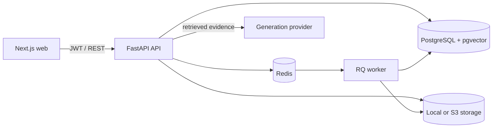

# Locus — AI Document Search

Locus is a private document-intelligence application: upload PDF, Markdown, or
text files, process them asynchronously, search with semantic and keyword
retrieval, and ask questions whose answers link back to exact source passages.


## Highlights

- Account registration, Argon2 password hashing, JWT authentication, and strict
  per-user authorization
- Content-aware uploads, size limits, duplicate detection, local/S3-compatible
  storage, processing status, and safe deletion
- Redis/RQ ingestion with retries, PDF page preservation, overlapping chunks,
  and batched, replaceable embeddings
- PostgreSQL full-text search plus pgvector cosine similarity, combined with a
  70/30 hybrid score and owner/date/type/document filters
- Grounded question answering with inspectable citations and an honest
  unsupported-answer response
- Prompt-injection boundaries, distributed rate limiting, audit logs, structured
  request logs, Prometheus metrics, and owner-scoped search caching
- Pytest quality evaluation, Vitest unit tests, Playwright smoke tests, GitHub
  Actions CI, production containers, Alembic migrations, and Render Blueprint

## Architecture



The provider boundaries keep embeddings, generation, and object storage
replaceable through configuration. See [architecture](docs/architecture.md) and
[API reference](docs/api.md).

## Quick start with Docker

Prerequisites: Docker Desktop with Compose v2.

```bash
cp .env.example .env
# Replace SECRET_KEY with a long random value.
docker compose up --build
```

Open <http://localhost:3000>. API documentation is at
<http://localhost:8000/docs>, health at <http://localhost:8000/health>, and
readiness at <http://localhost:8000/ready>, and Prometheus metrics at
<http://localhost:8000/metrics>.

The Compose stack starts Next.js, FastAPI, a Redis/RQ worker, PostgreSQL with
pgvector, and Redis. The API applies Alembic migrations before serving.

## Local development without Docker

Run PostgreSQL/pgvector and Redis, then:

```bash
cp .env.example .env
cd backend
python -m venv .venv
.venv/Scripts/pip install -e ".[dev]"  # Windows
alembic upgrade head
uvicorn app.main:app --reload
```

In two additional terminals:

```bash
cd backend
.venv/Scripts/rq worker ingestion --url redis://localhost:6379/0
```

```bash
cd frontend
npm install
npm run dev
```

On macOS/Linux, replace `.venv/Scripts/...` with `.venv/bin/...`.

## Configuration

All settings are environment variables; `.env` is ignored by Git. Important
values include:

| Variable | Purpose | Default |
| --- | --- | --- |
| `DATABASE_URL` | SQLAlchemy PostgreSQL/psycopg URL | Compose PostgreSQL |
| `REDIS_URL` | Jobs, rate limits, and search cache | Compose Redis |
| `SECRET_KEY` | JWT signing secret; 32+ characters in production | No safe production default |
| `STORAGE_BACKEND` | `local` or `s3` | `local` |
| `MAX_UPLOAD_SIZE_MB` | Upload limit | `20` |
| `EMBEDDING_PROVIDER` | Embedding adapter | `local` |
| `GENERATION_PROVIDER` | Grounded answer adapter | `extractive` |
| `RATE_LIMIT_PER_MINUTE` | Per-client, per-route limit | `60` |
| `SEARCH_CACHE_TTL_SECONDS` | Owner-scoped Redis cache TTL | `60` |

For `STORAGE_BACKEND=s3`, configure the `S3_*` variables shown in
`.env.example`. The endpoint may be AWS S3 or another S3-compatible provider.

## API example

```bash
curl -X POST http://localhost:8000/auth/register \
  -H "Content-Type: application/json" \
  -d '{"email":"demo@example.com","password":"correct horse battery staple"}'

curl -X POST http://localhost:8000/ask \
  -H "Authorization: Bearer YOUR_TOKEN" \
  -H "Content-Type: application/json" \
  -d '{"question":"What is the primary operational risk?"}'
```

Run `python backend/scripts/seed_demo.py` against a running stack to register a
demo account and upload the included risk report.

## Testing and quality

```bash
cd backend
ruff check .
ruff format --check .
pytest --cov=app --cov-report=term-missing

cd ../frontend
npm run lint
npm run test
npm run build
npm run test:e2e
```

The fixed evaluation set currently gates retrieval recall at 100%, precision at
50% or better, citation correctness and extractive groundedness at 100%, local
case latency below one second, and answer-behavior failures at zero. These are
small regression gates, not a broad benchmark claim. See
[evaluation methodology](docs/evaluation.md) and
[load testing](docs/performance.md).

## Deployment

`render.yaml` is a reproducible cloud target for the frontend, API, worker,
PostgreSQL, and Redis-compatible service. Cloud uploads use shared S3-compatible
storage. Follow [deployment instructions](docs/deployment.md); no deployment URL
is claimed until a Blueprint instance is provisioned with user-owned cloud and
object-storage credentials.

## Known limitations

- The included local embedding and extractive answer providers optimize for a
  private, API-key-free demo rather than state-of-the-art language quality.
- Scanned PDFs require an OCR adapter; the initial extractor handles text PDFs.
- DOCX support is intentionally deferred until the core PDF/TXT/Markdown path.
- Cache invalidation is TTL-based, so newly ingested content can take up to the
  configured cache TTL to appear for an identical query.

## Roadmap

- OCR and DOCX extraction
- Managed embedding/generation adapters with streaming responses
- Team workspaces and configurable retention policies
- Reranking, answer feedback, and a larger domain evaluation corpus

## License

[MIT](LICENSE)
