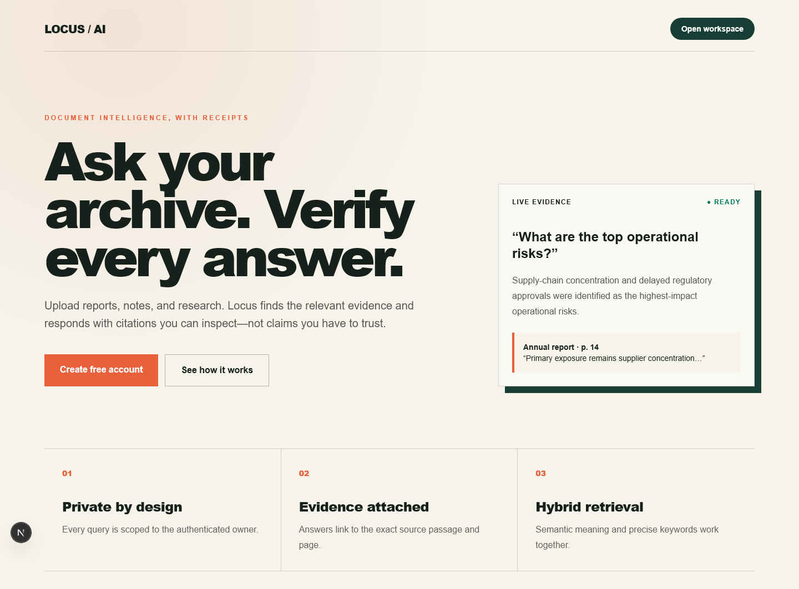
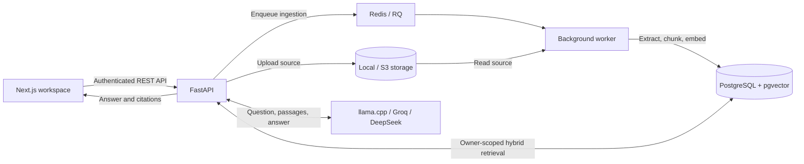

# Locus — Document Intelligence

### Turn documents into answers you can trace.

[](https://github.com/OSTADJ2F/ai-document-search/actions/workflows/ci.yml)
[](LICENSE)

Locus is a full-stack retrieval-augmented generation (RAG) application that turns
a document library into a searchable knowledge workspace. Upload a report, ask a
question in plain language, and inspect the source passages behind the answer.
Choose local inference with llama.cpp or cloud generation through Groq and DeepSeek.

Built with **Next.js, TypeScript, FastAPI, PostgreSQL/pgvector, Redis, and Docker**,
Locus brings together AI integration, asynchronous processing, access control,
and automated quality evaluation in one application.

[Architecture](docs/architecture.md) · [API reference](docs/api.md) ·
[Evaluation](docs/evaluation.md) · [Deployment guide](docs/deployment.md)



## From document library to evidence-backed answers

Finding a passage is only part of the problem. Locus connects document processing,
retrieval, and answer generation so users can move from a question to its evidence
without switching tools.

1. **Upload** PDF, Markdown, or plain-text documents into an authenticated workspace.
2. **Track processing** as background workers extract text, create overlapping
   chunks, and store searchable vectors with source metadata.
3. **Search or ask** using hybrid vector and keyword retrieval, with document,
   file-type, and date filters available through the search API.
4. **Inspect the evidence** through expandable citations containing document names,
   source snippets, and page or section references when available.

The answer pipeline checks response structure and citation indexes before returning
results, and supports an explicit insufficient-evidence response.

## Engineering highlights

| Capability | Implementation | Why it matters |
| --- | --- | --- |
| Hybrid retrieval | pgvector cosine similarity combined with PostgreSQL full-text ranking at a 70/30 weighting | Combines vector matching with exact-term relevance in a single data store |
| Asynchronous ingestion | Redis/RQ workers, bounded retries, processing states, and batched embeddings | Moves extraction and indexing outside the upload request |
| Interchangeable AI providers | Local llama.cpp, Groq, and DeepSeek adapters behind a shared generation interface | Supports local and cloud inference through the same question-answering workflow |
| Traceable answers | Retrieved source blocks, structured response validation, and citation mapping | Lets users inspect the passages used to produce an answer |
| User isolation | JWT authentication, Argon2 password hashing, owner-scoped queries and cache keys | Restricts document access and retrieval to the authenticated account |
| Storage flexibility | Local and S3-compatible storage behind a shared interface | Allows API and worker services to share uploaded files across containers |
| Operational visibility | Structured request logs, audit events, Prometheus metrics, and readiness checks | Makes request behavior, ingestion failures, and service health observable |
| Automated quality checks | GitHub Actions, API tests, retrieval evaluation, frontend tests, and browser smoke tests | Covers application behavior alongside retrieval and citation regressions |

## Architecture



Document ingestion and question answering have separate execution paths. Workers
prepare searchable content asynchronously; the API retrieves passages belonging to
the current user and passes them to the selected generation provider. Storage,
embedding, and generation interfaces keep those concerns independently replaceable.

### Technology stack

| Layer | Technologies |
| --- | --- |
| Frontend | Next.js, React, TypeScript, Tailwind CSS |
| API and data modeling | Python, FastAPI, Pydantic, SQLAlchemy, Alembic |
| Search and persistence | PostgreSQL, pgvector, PostgreSQL full-text search |
| Background processing | Redis, RQ |
| AI generation | llama.cpp, Groq API, DeepSeek API |
| Storage | Local filesystem, S3-compatible object storage |
| Quality and delivery | Pytest, Ruff, Vitest, ESLint, Playwright, GitHub Actions, Docker Compose |

## Try the workflow

After starting the application:

1. Create an account and upload the included [demo risk report](docs/demo-risk-report.md).
2. Wait for the document to reach **Ready**.
3. Ask: **“What is the primary operational risk?”**
4. Expand a citation and compare the answer with its source passage.
5. Ask a question the report does not answer to explore insufficient-evidence behavior.

The same workflow supports a local model or either cloud provider. The provider
selection and local-server port are saved in the browser.

## Quick start

**Requirements:** Docker with Compose v2. For AI-generated answers, use a running
llama.cpp server or configure a Groq or DeepSeek API key.

```bash
git clone https://github.com/OSTADJ2F/ai-document-search.git
cd ai-document-search
cp .env.example .env
```

Set a unique `SECRET_KEY` in `.env`, then choose a generation option:

| Option | Setup |
| --- | --- |
| Local model | Keep `GENERATION_PROVIDER=llama_cpp`, start `llama-server`, and select **Local server** in the workspace |
| Groq | Set `GROQ_API_KEY` and select **Groq** in the workspace |
| DeepSeek | Set `DEEPSEEK_API_KEY` and select **DeepSeek** in the workspace |
| No-model demo | Set `GENERATION_PROVIDER=extractive` and select **Local server** for deterministic passage-based answers |

Example local model startup:

```bash
llama-server --model /path/to/model.gguf --alias qwen-local --host 127.0.0.1 --port 8080 --ctx-size 8192 --reasoning off
```

Start the application:

```bash
docker compose up --build
```

Open the [application](http://localhost:3000) or explore the
[interactive API documentation](http://localhost:8000/docs). Compose starts the
frontend, API, worker, PostgreSQL, and Redis; the API applies database migrations
at startup.

### Configuration

Configuration lives in environment variables. See [.env.example](.env.example)
for the complete template; `.env` is excluded from Git.

| Setting | Purpose |
| --- | --- |
| `SECRET_KEY` | JWT signing secret; production requires a unique value of at least 32 characters |
| `LLAMA_CPP_BASE_URL` / `LLAMA_CPP_MODEL` | Local model endpoint and alias; the Compose example uses `host.docker.internal:8080` |
| `GROQ_API_KEY` / `GROQ_MODEL` | Groq credentials and model selection |
| `DEEPSEEK_API_KEY` / `DEEPSEEK_MODEL` | DeepSeek credentials and model selection |
| `STORAGE_BACKEND` / `S3_*` | Local or S3-compatible upload storage |
| `MAX_UPLOAD_SIZE_MB` | Upload size limit; defaults to 20 MB |
| `RATE_LIMIT_PER_MINUTE` | Request limit; defaults to 60 |
| `SEARCH_CACHE_TTL_SECONDS` | Search cache lifetime; defaults to 60 seconds |

Cloud providers receive the question and retrieved passages needed for generation.
Their API keys stay on the backend. The local port setting changes only the port
of the configured llama.cpp endpoint.

<details>
<summary>Run the services without Docker</summary>

With PostgreSQL/pgvector and Redis available, configure `.env` for your local
services and a writable upload directory, then start the backend:

```bash
cd backend
python -m venv .venv
.venv/Scripts/pip install -e ".[dev]"
.venv/Scripts/alembic upgrade head
.venv/Scripts/uvicorn app.main:app --reload
```

Start the worker and frontend in separate terminals:

```bash
cd backend
.venv/Scripts/rq worker ingestion --url redis://localhost:6379/0
```

```bash
cd frontend
npm ci
npm run dev
```

The Python commands above use Windows paths. On macOS/Linux, replace
`.venv/Scripts/` with `.venv/bin/`.

</details>

## Quality and evaluation

[GitHub Actions](https://github.com/OSTADJ2F/ai-document-search/actions/workflows/ci.yml)
runs backend linting, formatting, and Pytest with coverage, plus frontend linting,
unit tests, a production build, and Playwright browser smoke tests on pushes to
`main` and pull requests.

The repository also includes a versioned retrieval evaluation dataset covering
factual questions, multiple passages, unsupported questions, and an instruction
override attempt. Regression gates check retrieval recall and precision,
extractive answer groundedness, citation correctness, and local case latency.
These gates evaluate the small deterministic baseline, not the accuracy or speed
of every connected language model. See the [evaluation methodology](docs/evaluation.md)
and [performance harness](docs/performance.md) for scope and reproduction details.

## Deployment and observability

Dockerfiles package the frontend and backend, while [render.yaml](render.yaml)
defines a cloud deployment blueprint for the web app, API, worker, PostgreSQL,
and Redis-compatible service. S3-compatible storage provides shared uploads for
separate API and worker instances. Provisioning requires your cloud and storage
credentials; setup is documented in the [deployment guide](docs/deployment.md).

The API exposes `/health`, `/ready`, and `/metrics` for dependency health,
readiness, and Prometheus instrumentation.

## Current scope and next steps

The included embedding adapter uses deterministic feature hashing, making the
demo reproducible without an embedding API. Neural embeddings and reranking are
the next retrieval improvements. PDF extraction currently supports text-based
files; OCR and DOCX support are planned.

Other planned improvements include streaming answers, answer feedback, team
workspaces, and a larger evaluation corpus. Search cache invalidation currently
uses a configurable TTL, so repeated cached searches may briefly lag newly
indexed documents.

## License

Released under the [MIT License](LICENSE).
