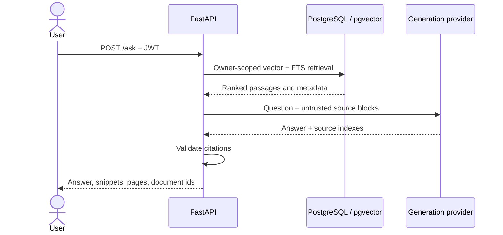

# Architecture

## Request and ingestion paths

```mermaid
sequenceDiagram
  actor User
  participant Web as Next.js
  participant API as FastAPI
  participant Queue as Redis / RQ
  participant Worker
  participant Store as Object storage
  participant DB as PostgreSQL / pgvector

  User->>Web: Upload document
  Web->>API: POST /documents + JWT
  API->>Store: Save immutable source
  API->>DB: Create uploaded record
  API->>Queue: Enqueue document id
  API-->>Web: 201 + uploaded status
  Queue->>Worker: Retryable job
  Worker->>DB: Mark processing
  Worker->>Store: Read source
  Worker->>Worker: Extract, chunk, embed
  Worker->>DB: Store chunks and vectors; mark ready
```



## Trust boundaries

- JWT subjects resolve to database users; every document query includes the
  authenticated user id. Missing and foreign resources both return 404.
- Upload extensions are checked against file signatures/UTF-8 content. Storage
  keys use generated UUIDs rather than supplied filenames.
- Document text is untrusted data. It is delimited from model instructions and
  never used as an executable prompt by the local extractive provider.
- Search cache keys contain a hash of the user id and complete filter payload.
- Production startup rejects short or default JWT secrets.

## Replaceable providers

`StorageProvider`, `EmbeddingProvider`, and `GenerationProvider` are narrow
interfaces selected by environment-backed settings. Local storage and deterministic
providers make development reproducible; S3-compatible storage supports separate
API and worker instances in production.

